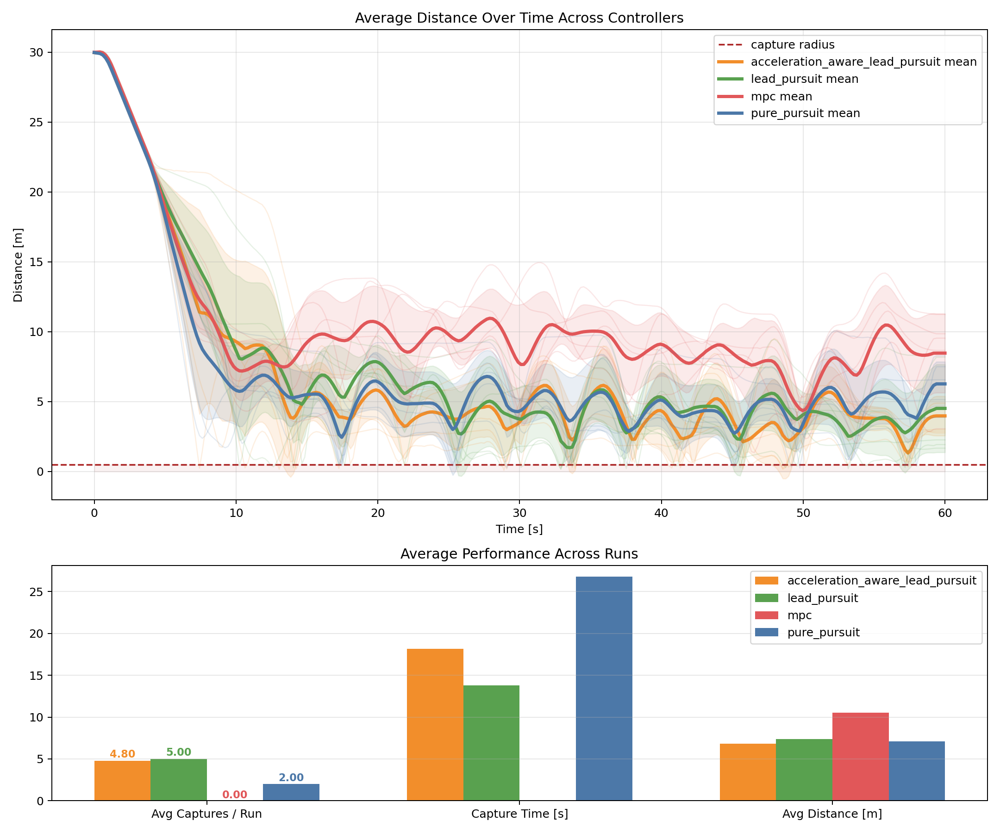
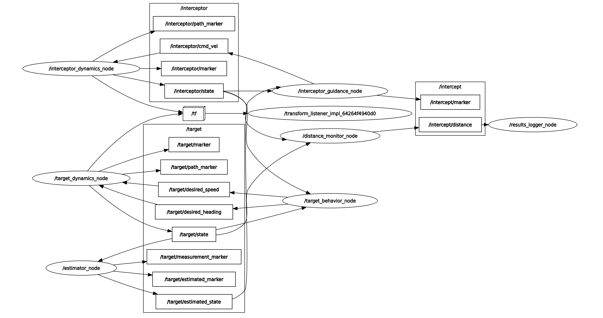

# Drone Interceptor

This package is a ROS 2 Humble simulation of a target drone and an interceptor drone.
It supports both a baseline guidance controller and an MPC-based controller so
you can compare how each interceptor behaves against the same target. 
Note that there may be bugs and that the MPC is currently quite bad and untuned.

## How To Use The Package

1. Source ROS 2 Humble.
2. Build the package from the workspace root.
3. Source the workspace overlay.
4. Launch the simulation with the controller and scenario you want.
5. Watch the motion in RViz, inspect distances with `rqt_plot`, and review saved
   result artifacts in `results/drone_interceptor`.

Typical workflow:

```bash
source /opt/ros/humble/setup.bash
colcon build --packages-select drone_interceptor --symlink-install
source install/setup.bash
ros2 launch drone_interceptor target_sim.launch.py
```

What the package does during a run:

- The launch file resolves a scenario, controller preset, profile, seed, and
  output settings from the YAML configs and any command-line overrides.
- The target behavior node generates desired heading and speed commands.
- The target dynamics node converts those commands into the target state plus
  RViz markers and TF updates.
- The estimator publishes a noisy target measurement and a filtered target
  estimate for downstream control.
- The launch selects either the baseline guidance+dynamics branch or the
  MPC+dynamics branch for the interceptor.
- A shared distance monitor publishes target-to-interceptor separation on
  `/intercept/distance`.
- The results logger records that distance stream and writes CSV, JSON, and PNG
  artifacts when the run ends.

## Build Commands

From the workspace root:

```bash
source /opt/ros/humble/setup.bash
colcon build --packages-select drone_interceptor --symlink-install
source install/setup.bash
```

Run tests:

```bash
source /opt/ros/humble/setup.bash
source install/setup.bash
colcon test --packages-select drone_interceptor
colcon test-result --verbose
```

## Launch Commands

### Default Launch

```bash
ros2 launch drone_interceptor target_sim.launch.py
```

Default behavior:

- scenario: `target_advantaged_default`
- controller preset: `baseline_lead_pursuit`
- target/interceptor start 30 meters apart
- target threat response is enabled
- RViz opens automatically
- `rqt_plot` opens automatically

### Launch Options


```bash
ros2 launch drone_interceptor target_sim.launch.py <argument>:=<value> <argument>:=<value>
```

The following launch arguments can be passed:

- `experiment:=baseline_pure_pursuit_advantaged | baseline_lead_pursuit_advantaged | baseline_acceleration_aware_advantaged | mpc_advantaged`
- `scenario:=matched_default | target_faster_default | target_more_maneuverable_default | target_advantaged_default | target_advantaged_close_start | target_advantaged_no_threat | target_advantaged_medium_noise`
- `controller_preset:=baseline_pure_pursuit | baseline_lead_pursuit | baseline_acceleration_aware | mpc_default`
- `profile:=matched | target_faster | target_more_maneuverable | target_advantaged`
- `controller_mode:=baseline | mpc`
- `guidance_mode:=pure_pursuit | lead_pursuit | acceleration_aware_lead_pursuit`
- `threat_response:=true | false`
- `spawn_distance:=[float]`
- `random_seed:=[int]`
- `open_rviz:=true | false`
- `open_plot:=true | false`
- `output_dir:=[path/string]`

## Guidance Math Summary

The baseline interceptor uses a fixed-speed pursuit command. After choosing an
aim point `p_aim`, it sends

```math
v_{\mathrm{cmd}} = v_{I,\max}\frac{p_{\mathrm{aim}} - p_I}{\lVert p_{\mathrm{aim}} - p_I \rVert}
```

where `p_I` is interceptor position and `v_I,max` is the configured interceptor
speed.

The guidance modes differ only in how `p_aim` is chosen:

- `pure_pursuit`: aim directly at the current target position,
  `p_aim = p_T`.
- `lead_pursuit`: assume constant target velocity and solve for intercept time
  `t_go` from

```math
\left\lVert p_T + v_T t - p_I \right\rVert = v_{I,\max} t
```

  which becomes the quadratic

```math
\left(\lVert v_T \rVert^2 - v_{I,\max}^2\right)t^2 + 2(p_T - p_I)\cdot v_T\, t + \lVert p_T - p_I \rVert^2 = 0
```

  The controller takes the smallest positive root, clips it to the configured
  prediction window, and aims at
  `p_aim = p_T + v_T t_go`.
- `acceleration_aware_lead_pursuit`: starts from the same lead-pursuit
  intercept time, then adds an acceleration settling term so the interceptor
  leads farther ahead when it is still building speed:

```math
t_{\mathrm{effective}} = t_{\mathrm{go}} + k_a\frac{v_{I,\max} - \lVert v_I \rVert}{a_{I,\max}}
```

  clipped to the same prediction bounds, with aim point
  `p_aim = p_T + v_T t_effective`.

If the interceptor is already inside the capture radius, the node stops
steering toward a future point and instead matches the target velocity so it
stays with the target.

## MPC Summary

The MPC controller uses a double-integrator interceptor model with state

```math
x = [p_x,\, p_y,\, p_z,\, v_x,\, v_y,\, v_z]
```

and control input

```math
u = [a_x,\, a_y,\, a_z]
```

Over a finite horizon, it predicts the target forward with a constant-velocity
model, rolls the interceptor state forward with candidate accelerations, and
optimizes the acceleration sequence at every control step. The cost function
penalizes:

- position error to the predicted target
- relative velocity error
- being outside the capture radius
- non-closing motion, via positive radial closing rate
- control effort and sudden control changes
- terminal position and terminal relative-velocity error

In plain terms, the MPC is trying to reach the target quickly, keep closing
instead of drifting away, and do so with smooth bounded accelerations. The
solver here is a small projected-gradient method: after each gradient step it
projects the candidate accelerations back onto the allowed acceleration limit,
and the rollout also enforces the configured speed and altitude bounds. The
first optimized acceleration is published, then the whole process repeats on
the next update with fresh state estimates.

## Performance

### Controller Videos

The clips below show one representative run for each controller in the
`target_advantaged_default` scenario.

GitHub does not render embedded video players in README files, so the clips are
linked below instead of shown inline.

Note: the videos can look a bit laggy because of compression. The underlying
simulation playback is smoother than the recorded clips suggest.

Marker key used in the videos:

- Red sphere and red trail: true target state and target path.
- Blue sphere and blue trail: baseline interceptor state and path.
- Green-teal sphere and green-teal trail: MPC interceptor state and path.
- Orange sphere/trail: noisy target measurement and, in the MPC clip, the
  predicted target trajectory over the optimization horizon.
- Green sphere: filtered target estimate used by the controller. If it is not
  visible, it is usually inside the red target marker.
- Yellow sphere: current intercept aim point in the baseline-controller clips.
- Bright green sphere: capture/intercept point in the baseline-controller
  clips once the interceptor is within the capture radius.
- Light pink sphere: current intercept aim point in the MPC clip.
- Cyan sphere: capture/intercept point in the MPC clip once the interceptor is
  within the capture radius.

### Pure Pursuit

Represents the `baseline_pure_pursuit` controller, where the interceptor aims
directly at the target's current position.

[Watch the pure pursuit video](docs/pure_pursuit_36s.mp4)

### Lead Pursuit

Represents the `baseline_lead_pursuit` controller, where the interceptor aims
at a predicted intercept point based on the target's current velocity.

[Watch the lead pursuit video](docs/lead_pursuit_36s.mp4)

### Acceleration-Aware Lead Pursuit

Represents the `baseline_acceleration_aware` controller, where the predicted
intercept point is adjusted to account for interceptor acceleration limits.

[Watch the acceleration-aware lead pursuit video](docs/accel_aw_lead_pursuit_36s.mp4)

### MPC

Represents the `mpc_default` controller, where the interceptor optimizes a
short acceleration horizon instead of following a fixed pursuit law.

[Watch the MPC video](docs/mpc_36s.mp4)

The figure below shows the averaged overlay comparison across five 60-second
runs for each guidance/controller method. The comparison used the
`target_advantaged_default` scenario with `profile:=target_advantaged`,
`spawn_distance:=30.0`, `threat_response:=true`, and five runs per method. The
evaluated presets were `baseline_pure_pursuit`, `baseline_lead_pursuit`,
`baseline_acceleration_aware`, and `mpc_default`, using seeds `0` through `19`
across the full batch.

Command used to generate the comparison data and averaged overlay:

```bash
run_experiment \
  --results-dir results/drone_interceptor_average_runs \
  --duration-s 60 \
  --runs-per-controller 5 \
  --controllers baseline_pure_pursuit baseline_lead_pursuit baseline_acceleration_aware mpc \
  --profile target_advantaged \
  --scenario target_advantaged_default \
  --spawn-distance 30.0 \
  --threat-response true \
  --seed-start 0

plot_results --results-dir results/drone_interceptor_average_runs
```



## Areas To Improve

- Dynamics and simulation fidelity: replace the current simplified point-mass
  behavior with a more realistic vehicle model, including better actuator
  limits, latency, turn-rate constraints, and disturbance models such as wind
  or model mismatch.
- Filtering and state estimation: improve the estimator so it handles noisy and
  maneuvering targets more robustly. Possible next steps include better process
  models, adaptive noise tuning, multi-rate filtering, or moving beyond the
  current basic Kalman-style setup when the target motion becomes strongly
  nonlinear.
- MPC quality and tuning: the current MPC works as a basic proof of concept,
  but it still needs better tuning and formulation work. Useful improvements
  could include a better target prediction model, improved cost weighting,
  longer or adaptive horizons, terminal constraints/costs, warm-starting,
  better numerical optimization, and explicit robustness against estimation
  error and aggressive target maneuvers.
- Alternative guidance/control approaches: add more advanced methods beyond the
  current pursuit laws and MPC. One interesting direction would be adversarial
  reinforcement learning, where the interceptor and target policies are trained
  against each other to learn harder pursuit-evasion behavior.
- Stochastic interception modeling: instead of treating the intercept point as
  deterministic, model it as a distribution under uncertainty in target motion,
  sensing, and actuation. That could support risk-aware guidance, chance
  constraints in MPC, and better reasoning about probable capture regions.

## Pipeline Summary

At startup, the launch file configures the scenario, controller mode, noise
settings, estimator topics, and output paths from the config files, then starts
the target, estimator, interceptor, monitoring, logging, and optional RViz and
`rqt_plot` processes together. The target behavior node samples a maneuver,
publishes `/target/desired_heading` and `/target/desired_speed`, and the target
dynamics node turns those commands into `/target/state` while also publishing
markers and TF for visualization.

That target state then flows through the estimator, which publishes both a
noisy measurement and a filtered estimate to simulate actual sensor data. The
interceptor side consumes the estimated target state and follows one of two
branches: the baseline branch uses `interceptor_guidance_node` to produce
`/interceptor/cmd_vel`, while the MPC branch uses `interceptor_mpc_node` to
produce `/interceptor_mpc/cmd_accel`. Their respective dynamics nodes convert
those commands into interceptor motion, the distance monitor publishes
`/intercept/distance`, and the results logger stores the run history plus
summary artifacts for later comparison.

## ROS Graph Overview

The diagram below summarizes the main nodes, topic groups, and data flow in the
baseline interception stack.



## What The Nodes And Scripts Do

### Nodes

`target_behavior_node`

- Purpose: generates the target's desired heading and desired speed.
- Inputs: interceptor state topic when threat response is enabled, random seed,
  speed limits, threat radius.
- Outputs: `/target/desired_heading`, `/target/desired_speed`.

`target_dynamics_node`

- Purpose: simulates the target as a point-mass vehicle with speed and
  acceleration limits.
- Inputs: `/target/desired_heading`, `/target/desired_speed`.
- Outputs: `/target/state`, target marker, target path marker, TF frame.

`estimator_node`

- Purpose: builds the target measurement stream and publishes a filtered target
  estimate.
- Inputs: `/target/state`, measurement noise settings, Kalman filter settings.
- Outputs: `/target/state_noisy`, `/target/estimated_state`, measurement marker,
  estimated marker.

`interceptor_guidance_node`

- Purpose: computes velocity commands for the baseline interceptor.
- Inputs: `/target/estimated_state`, `/interceptor/state`, guidance mode,
  interceptor speed, interceptor acceleration limit, capture radius.
- Outputs: `/interceptor/cmd_vel`, `/intercept/marker`.

`interceptor_dynamics_node`

- Purpose: simulates the baseline interceptor as a point-mass vehicle.
- Inputs: `/interceptor/cmd_vel`.
- Outputs: `/interceptor/state`, interceptor marker, interceptor path marker,
  TF frame.

`interceptor_mpc_node`

- Purpose: computes acceleration commands for the MPC interceptor.
- Inputs: `/target/estimated_state`, `/interceptor_mpc/state`, speed and
  acceleration limits.
- Outputs: `/interceptor_mpc/cmd_accel`.

`interceptor_mpc_dynamics_node`

- Purpose: simulates the MPC interceptor with acceleration commands.
- Inputs: `/interceptor_mpc/cmd_accel`.
- Outputs: `/interceptor_mpc/state`, MPC interceptor marker, MPC interceptor
  path marker, TF frame.

`distance_monitor_node`

- Purpose: measures separation between the target and the active interceptor.
- Inputs: `/target/state` and a configured interceptor state topic.
- Outputs: `/intercept/distance` or another configured distance topic.

`results_logger_node`

- Purpose: records each run and saves plots plus summary metrics.
- Inputs: distance topic, controller label, profile name, spawn distance,
  threat-response setting, output directory.
- Outputs: `<run_label>.csv`, `<run_label>.json`, `<run_label>.png`.

### Scripts

`compare_results`

- Purpose: aggregates saved run artifacts and produces comparison figures.
- Inputs: a results directory containing run CSV/JSON/PNG files.
- Outputs: aggregate comparison PNGs and `aggregate_summary.md`.

Run it with:

```bash
compare_results --results-dir results/drone_interceptor
```

or:

```bash
python3 src/drone_interceptor/scripts/compare_results.py --results-dir results/drone_interceptor
```

`organize_results`

- Purpose: helps reorganize generated run artifacts into cleaner result folders.
- Inputs: generated result files.
- Outputs: moved or grouped result artifacts.

`plot_results`

- Purpose: creates averaged overlay plots and summary tables from repeated
  controller runs.
- Inputs: a results directory such as `results/drone_interceptor_average_runs`
  containing run CSV/JSON files.
- Outputs: `average_overlay_comparison.png` and
  `average_overlay_summary.md`.

`run_experiment`

- Purpose: launches predefined experiment configurations for repeatable runs.
- Inputs: experiment selection, controller list, scenario/profile overrides,
  seed range, and output directory settings.
- Outputs: repeated run artifacts in the chosen results directory.

`record_showcase`

- Purpose: records showcase runs for demonstration assets.
- Inputs: controller selection, launch overrides, recording duration, and an
  output directory for saved videos.
- Outputs: recorded showcase `.mp4` files.
